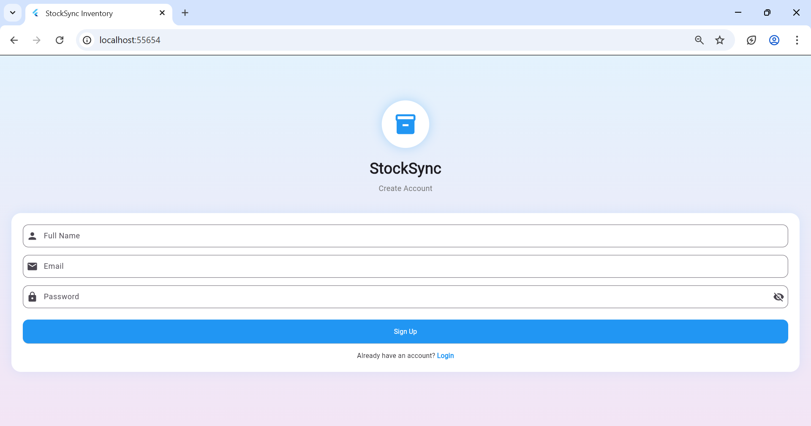
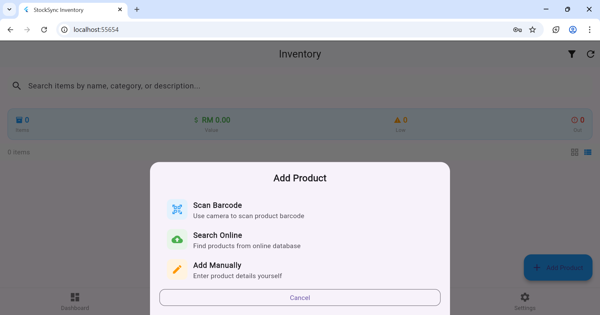
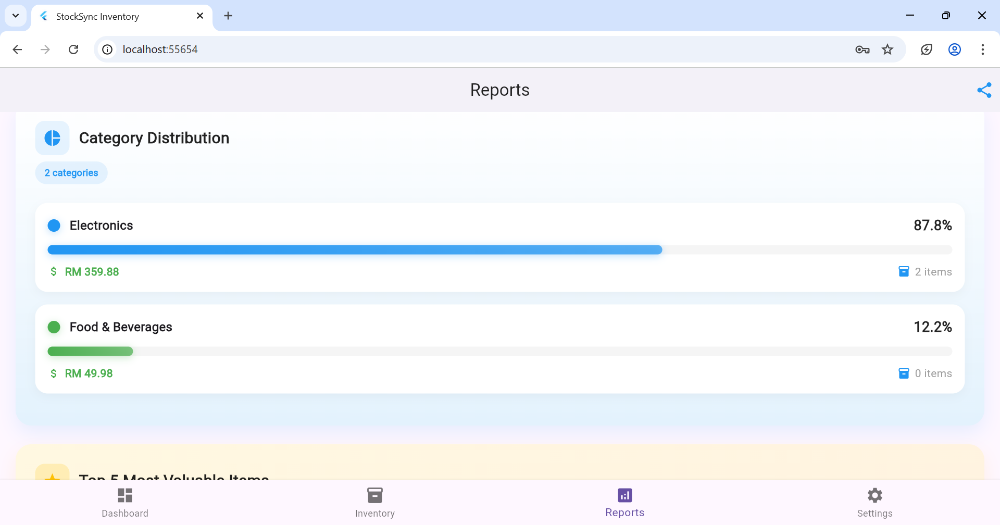
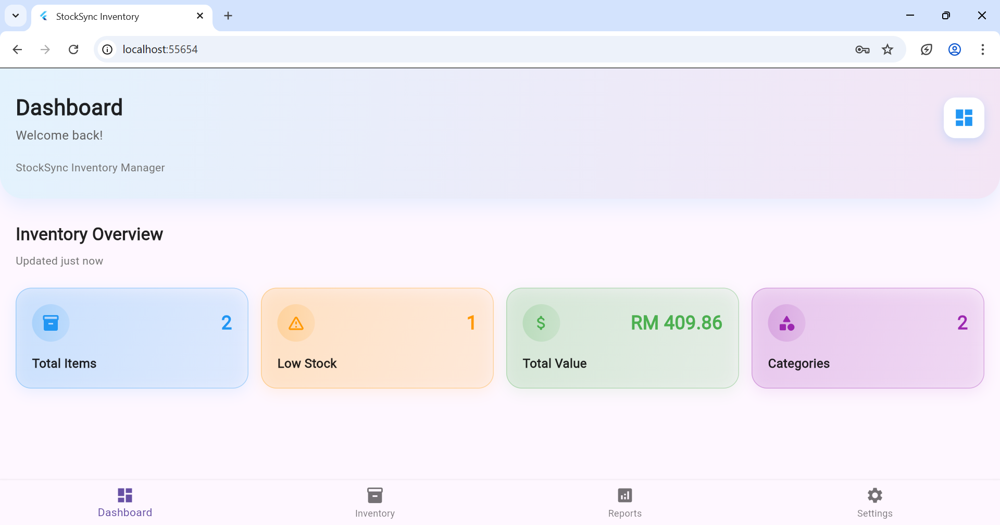

# StockSync Inventory Management System

A mobile inventory management application built with Flutter that helps small businesses and individuals track stock levels efficiently.

## 📱 Screenshots

| Login | Dashboard | Inventory |
|-------|-----------|-----------|
|  |  |  |

| Add Item |
|----------|
|  |

## ✨ Features

- **Authentication** - Login and signup functionality
- **Dashboard** - Real-time inventory overview with statistics
- **Inventory Management** - Full CRUD operations with search and filter
- **Product Search** - Mock API integration with 20+ products
- **Barcode Scanner** - Quick product addition using camera
- **Reports & Analytics** - Category distribution and top items
- **User Settings** - Profile management and app preferences

## 🛠️ Tech Stack

- **Framework:** Flutter
- **Database:** SQLite (with web fallback)
- **Local Storage:** SharedPreferences
- **API:** Mock API (npoint.io)
- **Device Features:** Camera (barcode), Gallery, Share

## 🚀 Installation

```bash
# Clone the repository
git clone https://github.com/abbysherryyy/stocksync.git

# Navigate to project
cd stocksync

# Get dependencies
flutter pub get

# Run the app
flutter run

📦 Building APK
bash
# Debug APK
flutter build apk --debug

# Release APK
flutter build apk --release

📄 License
This project is for educational purposes.